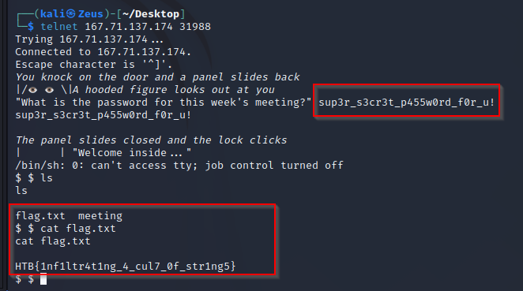

```c
undefined8 main(void)

{
  int iVar1;
  char *pcVar2;
  char local_48 [64];
  
  setvbuf(stdout,(char *)0x0,2,0);
  puts("\x1b[3mYou knock on the door and a panel slides back\x1b[0m");
  puts(&DAT_00102040);
  fwrite("\"What is the password for this week\'s meeting?\" ",1,0x30,stdout);
  fgets(local_48,0x40,stdin);
  pcVar2 = strchr(local_48,10);
  *pcVar2 = '\0';
  iVar1 = strcmp(local_48,"sup3r_s3cr3t_p455w0rd_f0r_u!");
  if (iVar1 == 0) {
    puts("\x1b[3mThe panel slides closed and the lock clicks\x1b[0m");
    puts("|      | \"Welcome inside...\" ");
    system("/bin/sh");
  }
  else {
    puts("   \\/");
    puts(&DAT_00102130);
  }
  return 0;
}
```





```text
HTB{1nf1ltr4t1ng_4_cul7_0f_str1ng5}
```