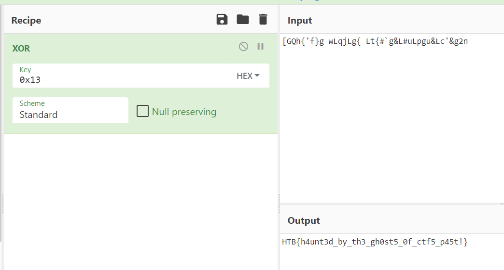

```c
void * get_flag(void)

{
  void *__s;
  uint local_c;
  
  __s = malloc(0x29);
  memset(__s,0,0x29);
  for (local_c = 0; local_c < 0x28; local_c = local_c + 1) {
    *(byte *)((long)__s + (long)(int)local_c) = _[(int)local_c] ^ 0x13;
  }
  return __s;
}
```




```text
HTB{h4unt3d_by_th3_gh0st5_0f_ctf5_p45t!}
```