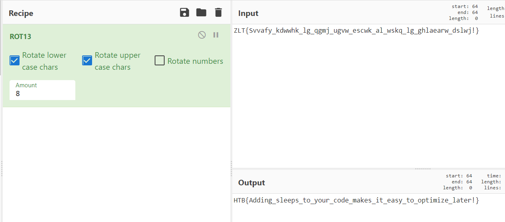

```c
int main(void)

{
  int r;
  char *flag;
 
  
  
  flag = strdup("ZLT{Svvafy_kdwwhk_lg_qgmj_ugvw_escwk_al_wskq_lg_ghlaearw_dslwj!}");
  r = r + 5;
 
  for (; *flag != '\0'; flag = flag + 1) {
    if ((*flag < 'a') || ('z' < *flag)) {
   
      if (*flag-r < 'A') { //Z-5 = U < A = false
        
    
          *flag = *flag + 26;
        }
        *flag = *flag-r;
      
    }
    else {
     
      if (*flag-r < 'a') { //U < a = true (85 < 97)
        
        *flag = *flag + 26; //Z + 26 (90 + 26 = 116)
      }
      *flag = *flag -r;
    }

    printf("%c",*flag);
  }
  return 0;
}
```


