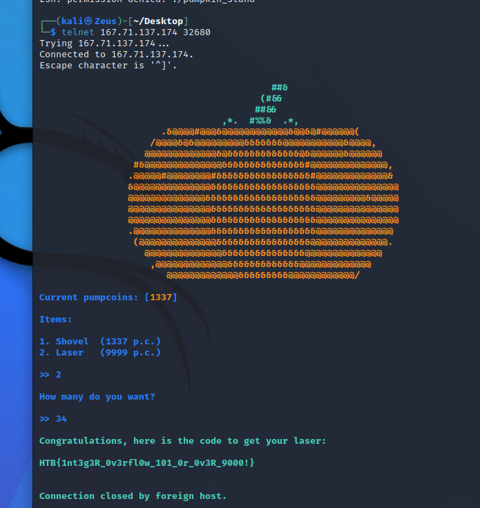

```c
  while( true ) {
    while( true ) {
      while( true ) {
        while( true ) {
          menu();
          __isoc99_scanf(&DAT_0010132b,&local_54);
          printf("\nHow many do you want?\n\n>> ");
          __isoc99_scanf(&DAT_0010132b,&local_52);
          if (0 < local_52) break;
          printf("%s\n[-] You cannot buy less than 1!\n",&DAT_0010134a);
        }
        pumpcoins = pumpcoins -
                    local_52 * (short)*(undefined4 *)((long)&values + (long)(int)local_54 * 4);
        if (-1 < pumpcoins) break;
        printf("\nCurrent pumpcoins: [%s%d%s]\n\n",&DAT_00100e80,(ulong)(uint)(int)pumpcoins);
        printf("%s\n[-] Not enough pumpcoins for this!\n\n%s",&DAT_0010134a,&DAT_00100e78);
      }
      if (local_54 != 1) break;
      printf("\nCurrent pumpcoins: [%s%d%s]\n\n",&DAT_00100e80,(ulong)(uint)(int)pumpcoins);
      puts("\nGood luck crafting this huge pumpkin with a shovel!\n");
    }
    if (0x270e < pumpcoins) break;
    printf("%s\n[-] Not enough pumpcoins for this!\n\n%s",&DAT_0010134a,&DAT_00100e78);
  }
  local_48 = 0;
  local_40 = 0;
  local_38 = 0;
  local_30 = 0;
  local_28 = 0;
  local_20 = 0;
  local_50 = fopen("./flag.txt","rb");
  if (local_50 != (FILE *)0x0) {
    fgets((char *)&local_48,0x30,local_50);
    printf("%s\nCongratulations, here is the code to get your laser:\n\n%s\n\n",&DAT_00100ee3,
           &local_48);
                    /* WARNING: Subroutine does not return */
    exit(0x16);
  }
  puts("Error opening flag.txt, please contact an Administrator!\n");
                    /* WARNING: Subroutine does not return */
  exit(1);
}
```




```text
HTB{1nt3g3R_0v3rfl0w_101_0r_0v3R_9000!}
```