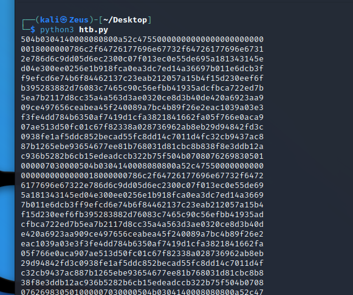
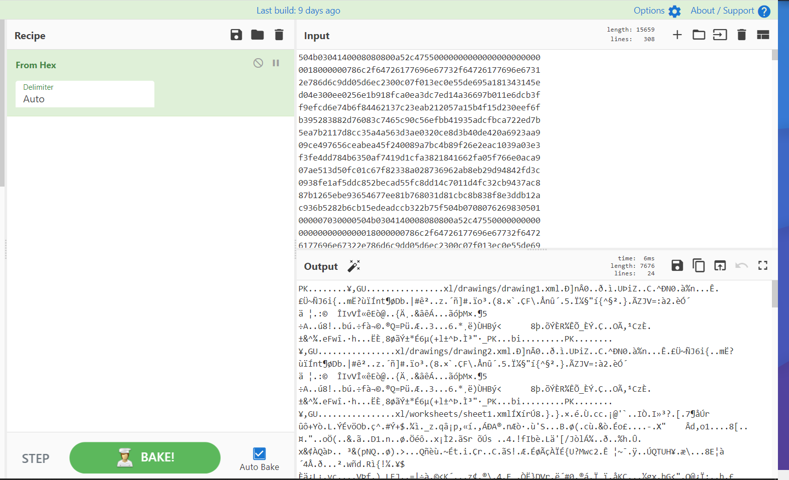
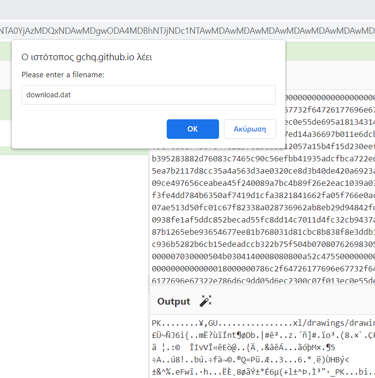
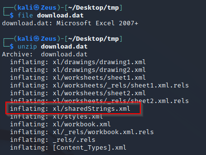
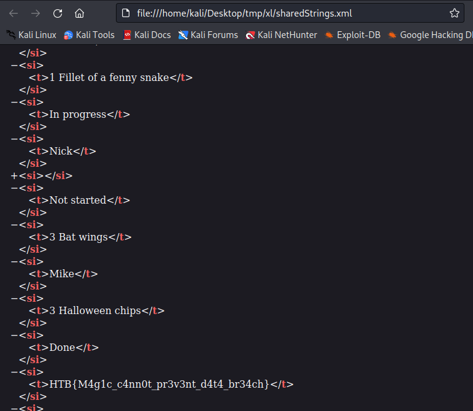

https://book.hacktricks.xyz/generic-methodologies-and-resources/basic-forensic-methodology/pcap-inspection/dnscat-exfiltration

```python
from scapy.all import rdpcap, DNSQR, DNSRR

last_qry = ''
out = ''
q_nb = 0

for p in rdpcap('capture.pcap'):

        if p.haslayer(DNSQR) and not p.haslayer(DNSRR):

            qry = p[DNSQR].qname.decode().replace('.pumpkincorp.com.', '').split('.')
            print(qry[0])
```












```text
HTB{M4g1c_c4nn0t_pr3v3nt_d4t4_br34ch}
```